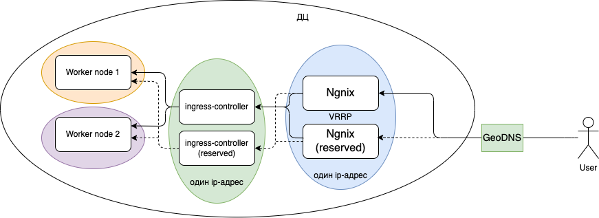
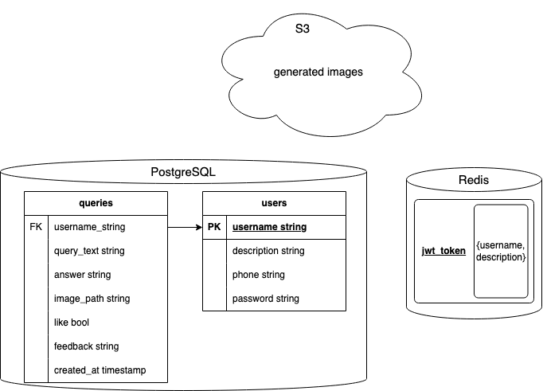

# ChadGPT_Highload
Проектирование высоконагруженной большой языковой модели для генерации текста и ответов на вопросы

## Оглавление
1. [Тема и целевая аудитория](#1)
2. [Расчет нагрузки](#2)
3. [Глобальная балансировка нагрузки](#3)
4. [Локальная балансировка нагрузки](#5)
5. [Логическая схема БД](#6)
6. [Физическая схема БД](#7)
7. [Технологии](#8)
8. [Схема проекта](#9)
9. [Обеспечение надёжности](#10)

## 1. Тема и целевая аудитория <a id="1"></a>

### Тема
Сервис ChatGPT – это большая языковая модель, обученная OpenAI, которая использует глубокое обучение для генерации текста и ответов на вопросы.
Данный сервис, у которого существенная часть логики приходится на бекенд, имеет конечного массового пользователя.

### Целевая аудитория
| Характеристика    |  Значение  |
|:------------------|:----------:|
| Целевая аудитория | Всемировая |
| MAU [1]           |   180,5M   |
| DAU [2]           |    13M     |

Ниже представлена таблица, показывающая долю пользователей ChatGPT из разных стран:
<a id="4"></a>

| Страна            |  Процент пользователей ChatGPT  |
|:------------------|:-------------------------------:|
| Соединенные Штаты |              14,4%              |
| Индия             |              6,9%               |
| Колумбия          |              3,56%              |
| Филиппины         |              3,49%              |
| Япония            |              2,96%              |
| Другие страны     |              68,69%             |

### Функционал
- Обработка текстовых запросов пользователя для генерации текста
- Обработка текстовых запросов пользователя для генерации изображения

## 2. Расчет нагрузки <a id="2"></a>

### Продуктовые метрики

#### Расчет продуктовых метрик

В сутки ChatGPT получает 10M запросов [3] за 2023, за 2023 MAU = 100M [4], следовательно DAU2023 = 13M*100M/180,5M = 7,2M, значит в сутки ChatGPT получает 10M * 13M / 7,2M = 18,06M, из них 2M запросов на генерацию изображений [5], значит на генерацию текстов уходит 16,06M запросов в сутки.

На данных момент максимальное количество символов в запросе ChatGPT составляет 2048 [6]. Для хранения текстов пользователя в чатах необходимо хранилище размера:
```
(((2048*2) символов * 1/1024/1024/1024) Гб * 16_000_000) Гб/сутки * 30*12*3 / 13_000_000 ≈ 0,005 Гб
```

На данный момент размер генерируемого DALLE-изображения в среднем 1024x1024 пикселя [7] + сам запрос для генерации 1024 байта. Для хранения изображений в чатах необходимо хранилище размера:
```
(((((1024*1024) пикселей * 24/8) байт + 2048 байт) байт /1024/1024/1024) Гб * 2_000_000) Гб/сутки * 30*12*3 / 13_000_000 = 0,49 Гб ≈ 1 Гб
```

Примерно раз в квартал будет переобучение модели – это 4 переобучения в год. Учитывая, что на обучение необходим набор данных размером 570 Гб [8], для обучение пригодить хранилище размером:
```
570 Гб * 4 * 3 = 6_840 Гб
```

Размер модели составляет 700 Гб [9] – это 9 видеокарт A100 (по 80 Гб)

#### Сводная таблица продуктовых метрик
| Характеристика                                                    |  Метрика   |
|:------------------------------------------------------------------|:----------:|
| MAU                                                               |  180,5M    |
| DAU                                                               |    13M     |
| Средний размер хранилища пользователя                             | 1,005 Гб   |
| Средний размер хранилища для обучения                             | 6_840 Гб   |
| Средний размер модели                                             |  700 Гб    |
| Среднее количество действий пользователя по генерации текста      | 16 M/сутки |
| Среднее количество действий пользователя по генерации изображения | 2 M/сутки  |

### Технические метрики

#### Расчет технических метрик

Для хранения текстов в чатах необходимо хранилище размера:
```
(((2048*2) символов * 1/1024/1024/1024/1024) Тб * 14_000_000) Тб/сутки * 30*12*3 = 32,19 Тб ≈ 33 Тб
```

Для хранения изображений в чатах необходимо хранилище размера:
```
(((((1024*1024) пикселей * 24/8) байт + 1024 байта)/1024/1024/1024/1024) Тб * 2_000_000) Тб/сутки * 30*12*3 = 6_182 Тб ≈ 6_200 Тб
```

Возьмем небольшой коэфицент k=1,5 отличия от среднего трафика для получения пикового трафика по генерации текста:
```
(((2048*2) символов * 8/1024/1024/1024) Гбит * 16_000_000 запросов/сутки) Гбит/сутки / 24/60/60 * 1,5 = 0,004 Гбит/с
```

Возьмем небольшой коэфицент k=1,5 отличия от среднего трафика для получения пикового трафика по генерации изображения:
```
(((((1024*1024) пикселей * 24) бит + 2048*8 бит)/1024/1024/1024) Гбит * 2_000_000 запросов/сутки) Гбит/сутки / 24/60/60 * 1,5 = 0,81 Гбит/с
```

Для получения суммарного суточного трафика по генерации текста:
```
(((2048*2) символов /1024/1024/1024) Гбайт * 16_000_000 запросов/сутки) Гбайт/сутки = 61,04 Гбайт/сутки
```

Для получения суммарного суточного трафика по генерации изображения:
```
(((((1024*1024) пикселей * 24) бит + 2048*8 бит) /1024/1024/1024) Гбит * 2_000_000 запросов/сутки) Гбит/сутки = 46_906 Гбайт/сутки
```

RPS по генерации текста:
```
16_000_000 запросов/сутки / 24/60/60 = 185,185 запросов/с
```

RPS по генерации текста:
```
2_000_000 запросов/сутки / 24/60/60 = 23,15 запросов/с
```

#### Сводная таблица технических метрик

| Характеристика                           |        Метрика         |
|:-----------------------------------------|:----------------------:|
| Размер хранения по генерации текста      |         33 Тб          |
| Размер хранения по генерации изображения |        6_200 Тб        |
| Пиковое потребление в теченнии суток     |      0,814 Гбит/с      |
| Суммарный суточный                       |    61,04 Гбайт/сутки   |
| RPS по генерации текста                  |   185,185 запросов/с   |
| RPS по генерации изображения             |    23,15 запросов/с    |

### 3. Глобальная балансировка нагрузки <a id="3"></a>

#### Физическое расположение ДЦ

Из [таблицы](#4), представленной в 1 пункте и показывающей долю пользователей ChatGPT из разных стран, можно сделать вывод, что самая большая часть пользователей в США. Поэтому датацентры будут распологаться в США, прежде всего в крупных городах:
- Нью-Йорк
- Сан-Франциско
- Сиэтл
- Даллас
Каждый из этих ДЦ будет иметь:
~ rps по генерации текста равный 185,185 * 0,144 / 4 ≈ 7 запроса в секунду
~ rps по генерации изображения равный 23,15 * 0,144 / 4 ≈ 1 запрос в секунду

Индия тоже входит в топ по количеству пользователей. Будет хорошим решением расположить ЦОДы в следующих городах:
- Нью Дели
- Мумбаи
Каждый из этих ДЦ будет иметь:
~ rps по генерации текста равный 185,185 * 0,07 / 2 ≈ 7 запроса в секунду
~ rps по генерации изображения равный 23,15 * 0,07 / 2 ≈ 1 запрос в секунду

Остальные 14 ДЦ имеют одинаковое распространение по использованию сервиса, поэтому на каждый из них будет:
~ rps по генерации текста равный 185,185 * 0,03 / 14 ≈ 1 запрос в секунду
~ rps по генерации изображения равный 23,15 * 0,03 / 14 ≈ 1 запрос в секунду

Далее по численности идет Колумбия, ДЦ там лучше расположить в столице:
- Богота

Далее в Филлипинах ДЦ можно расположить в:
- Манила

Следующая страна по количеству пользователей – Япония, ДЦ будет покрывать Восточную Азию и Дальний Восток России и будет располагаться в:
- Токио

ДЦ в крупных городах Казахстана обеспечат покрытие в центральной России и серединную часть Евразии:
- Алматы
- Караганда

На Европу приходится процента пользователей, причем пользователи равномерно распределены по всей территории. Поэтому расположение будет следующим:
- Лондон (северная Европа)
- Франкфурт (средняя и восточная Европа)
- Париж (западная Европа)
- Стокгольм (северная Европа и Россия)
- Мадрид (южная Европа)
- Хельсинги (северо-восточная Европа)

На Бразилию приходится также большая часть пользователей. Располагаем ДЦ в следующих местах:
- Сан-Паулу

Так как в Африке нет большого количества пользователей, то этому региону будет достаточно расположить 1 датацентр, тк он находится на Юге Африки, для которой Европейские сервера будут отвечать дольше, чем для Северной, ДЦ будет располагаться в:
- Йоханнесбург

Для покрытия Австалии нужен ДЦ в:
- Сидней

Для покрытия западной России достаточно будет ДЦ в:
- Москве

#### Схема расположения ДЦ


Также доступна [интерактивная карта](https://yandex.ru/maps/?um=constructor%3A27658908c35efda22009c7f27a563c25f28a430bf93ff75fed320d3310fb48a7&source=constructorLink)

Междатацентровая балансировка происходит благодаря GeoDNS.

### 4. Локальная балансировка нагрузки  <a id="5"></a>

#### Схема локальной балансировки нагрузки



Запрос от клиента, который находится справа на схеме, идет по Всемирной паутине и благодаря GeoDNS находит необходимый ДЦ, далее по технологии IP Tunnelling запрос пропускается на определенный адрес ngnix, все ngnix, находятся на одном ДЦ, они перенаправляют в ingress-controller, а далее он направляет в определенную ноду (на определенный физический сервер), в котором сервис в pod принимает запрос.

#### L4-балансировка (VIP)

Необходим для обеспечения производительности.

#### L7-балансировка (Ngnix)

Обеспечивает равномерное распределение нагрузки, надежное резервирование.

### 5. Логическая схема БД <a id="6"></a>

#### Сущности и атрибуты БД

Ниже представлены таблицы, поля и связи между ними без привязки к конкретным базам и шардингу.


Далее опишем назначение каждой из таблицы.

| Таблица        |                                           Описание                                          |
|:---------------|:-------------------------------------------------------------------------------------------:|
| queries        |                    хранения запросов для отображения истории и переобучения                 |
| images         |                    хранения сгенерированных изображений                 |
| users          |        хранения данных о пользователе и добавления контекста к запросам пользователя        |
| authorization  |                              хранения кук пользователя в кэше                               |

#### Размеры данных

Из расчетов выше был вывод, что необходим 0,005 ГБ на одного пользователя, если активных пользователей каждый день 13М, и расчет идет на 3 года, то на хранение данных запросов уйдет:
```
(0,005 ГБ * 13М) ГБ / 1024 ≈ 63,5 Тб
```

C учетом, что на одного пользователя был расчитан 1 ГБ, то на хранение изображений в ответ на запросы уйдет:
```
(1 ГБ * 13М) ГБ / 1024 / 1024 ≈ 12,4 Пб
```

| Данные                                             | Размер     |
|:---------------------------------------------------|:----------:|
| Хранение данных запросов на всех ДЦ в сумме        |  63,5 Тб   |
| Хранение изображений на всех хранилищах ДЦ в сумме |  12,4 Пб   |
| Вес моделей на каждой из 20 ДЦ	                 | 700 Гб     |
| Вес дополнительных данных для обучения на 1 ДЦ     | 6_840 ГБ   |

#### Нагрузки на чтение/запись
queries: В день запросов 16М, допустим читаются запрос в 4 раза меньше, то есть 4М на чтение чатов в день – это 46 запросов в секунду, записывается запрос 16M в день, также треть этих запросов еще оцениваются и дозаписываются в таблицу, получается примерно 20M день на запись – это 231 rps.
images: В день запросов 2М, допустим читаются запрос в 4 раза меньше, то есть 1/2М на чтение чатов в день – это 7 запросов в секунду, записывается запрос 2M в день, также треть этих запросов еще оцениваются и дозаписываются в таблицу, получается примерно 2,5M день на запись – это 29 rps.
users: В день запросов 16M, значит примерно 16M чтений в день для прикладывание контекста – это 150 rps, регистрируется - 5 rps.
authorization: В день активных пользователей 13M для прокидывания куки, куки примерно на 30 дней (делим на 30), поэтому rps на запись куки – это 5 rps, а читается все 16M раз в день – это 150 rps.

| Данные        | Чтение   | Запись   |
|:--------------|:--------:|:--------:|
| queries       |  46 rps  |  231 rps |
| images        |  7 rps   |  29 rps  |
| users	        |  150 rps |  5 rps   |
| authorization |  150 rps |  5 rps   |

### 6. Физическая схема БД <a id="7"></a>

#### Схема с привязкой к конкретным БД

Ниже представлена схема со списком таблиц, полей и связей между ними с привязкой к конкретным базам.



#### Репликация PostgreSQL

У каждой мастер бд будет по 2 реплики, на запись данных для хранения резервной бд.

#### Шардинг

Шардинг будет по имени username в таблицах users и queries.

#### Индексы

У таблицы users и queries будет по уникальному индексу на столбец username.

#### Денормализация

Описание к пользователю будет храниться в куках, чтобы не ходить в таблицу users за описанием. Описание нужно для контекста к обработке запроса ML. Описание будет присылаться в куках в jwt-токенах.

### 7. Технологии <a id="8"></a>

|Технология | Необходимость использования|
|:----------|:--------------------------:|
| WebSocket | Поддержка чата             |
| Nginx     | Редиректинг                |
| Ingress-controller | Балансировка по нодам |
| Cubernetes | Автоматизация DevOps      |
| Redis     | Работа с токенами          |
| gRPCStream | Обращение к микросервисам  |
| Golang    | Язык для web-сервисов      |
| Python    | Язык для ML                |
| PostgreSQL | Хранение данных           |
| S3        | Хранение генерируемых изображений |
| stateless-posrtgres-query-request | Proxy-сервер для шардирования бд |
| PyTorch и Tensorflow | LLM-библиотека |

### 8. Схема проекта <a id="9"></a>


### 9. Обеспечение надёжности <a id="10"></a>

| Компонент     | Метод    | Обоснование |
|:--------------|:--------:|:--------:|
| WebSocket     | Failover policy | Соединение по websocket прерывается раз в N-ое время. Необходимо реализовать повторное подключение |
| Nginx         | Резервирование | Необходимо иметь два ngnix в каждом ДЦ, каждый будет на одинаковом ip-адресе, второй ngnix будет подменять при отказе первого ngnix |
| Ingress-controller | Резервирование и Балансировка | Необходимо иметь запасной ingress-controller при отказе главного |
| Cubernetes | Health-controller и Балансировка | Необходим для балансировки нагрузки между подами и контроля жизни подов для их своевременной замены и перезапуска |
| Redis | Резервирование | Redis используется для авторизации пользователя, в случае, если откажет одна БД, ее подменит поднятая вторая БД. Репликация не требуется, так как токены – не критичная информация в сравнении с затраченными ресурсами для репликации |
| PostgreSQL | Репликация | Необходима репликация в связи с важностью сохранения истории чатов и данных о существовании пользователя |
| S3 | Репликация | Необходима репликация в связи с важностью сохранения сгенерированных изображений пользователя |

Backend должен удовлетворять методам:
• Балансировка – несколько подов для распределении нагрузки в одном ДЦ.
• Сегментирование – объединение сложный и важных запросов отдельно от объединения остальных запросов (по API).
• Graceful shutdown – завершение оставшихся процессов после получения сигнала остановки и перед остановкой сервиса.
• Graceful degradation – разработка системы, готовой к неожиданным ответам внутренней логики.

Frontend должен удовлетворять методам:
• Резервирование – несколько подов для резервирования фронтенда на случай отказа главного пода.
• Сегментирование – объединение сложный и важных запросов отдельно от объединения остальных запросов (по API).
• Failover policy – политика ретраев к бэкенду.
• Graceful degradation – разработка системы, готовой к неожиданным ответам backend.

## Источники

1. https://www.demandsage.com/chatgpt-statistics/#:~:text=chatbot%20has%20over-,180.5%20million%20MAUs,-.
2. https://artsmart.ai/blog/number-of-chatgpt-users/#:~:text=13%20million%20unique%20visitors%20used%20ChatGPT%20daily
3. https://www.mlyearning.org/chatgpt-statistics/#:~:text=ChatGPT%20receives%20approximately%2010%20million%20queries%20per%20day
4. https://explodingtopics.com/blog/chatgpt-users#:~:text=100%20million%20monthly%20active%20users
5. https://www.notta.ai/en/blog/chatgpt-statistics#:~:text=Users%20generate%20about%202%20million%20images%20every%20day%20using%20OpenAI%27s%20DALL.E%202
6. https://chatgptdetector.co/chatgpt-character-limit/#:~:text=Currently%2C%20the%20character%20limit%20for%20ChatGPT%20is%202048%20characters
7. https://tecnosoluciones.com/revolutionizing-visual-creation-how-to-create-images-using-chatgpt/?lang=en#:~:text=The%20maximum%20image%20dimensions%20that%20ChatGPT%20can%20create%2C%20specifically%20through%20tools%20like%20DALL%2DE%2C%20are%20generally%201024%C3%971024%20pixels%20for%20square%20images
8. https://teamtutorials.com/other-tutorials/how-big-is-chatgpt-dataset#:~:text=ChatGPT%20has%20been%20trained%20on%20a%20dataset%20that%20contains%20over%20570GB%20of%20text%20data
9. https://www.codetd.com/ru/article/16382788#:~:text=%D0%B2%D1%8B%D0%BF%D0%BE%D0%BB%D0%BD%D1%8F%D0%B5%D1%82%20%D1%82%D0%BE%D0%BB%D1%8C%D0%BA%D0%BE%20%D0%B2%D1%8B%D0%B2%D0%BE%D0%B4%2C-,%D0%B2%D0%B8%D0%B4%D0%B5%D0%BE%D0%BF%D0%B0%D0%BC%D1%8F%D1%82%D1%8C%20%D0%B2%20%D1%80%D0%B5%D0%B6%D0%B8%D0%BC%D0%B5%20%D0%BE%D0%B6%D0%B8%D0%B4%D0%B0%D0%BD%D0%B8%D1%8F%20%D0%B7%D0%B0%D0%BD%D0%B8%D0%BC%D0%B0%D0%B5%D1%82%20%D0%BE%D0%BA%D0%BE%D0%BB%D0%BE%20700%20%D0%93%D0%91%20%D0%B8%20%D1%82%D1%80%D0%B5%D0%B1%D1%83%D0%B5%D1%82%20%D0%BE%D0%BA%D0%BE%D0%BB%D0%BE%209%20%D0%B2%D0%B8%D0%B4%D0%B5%D0%BE%D0%BA%D0%B0%D1%80%D1%82%20A100%20(80%20%D0%93%D0%91),-.
